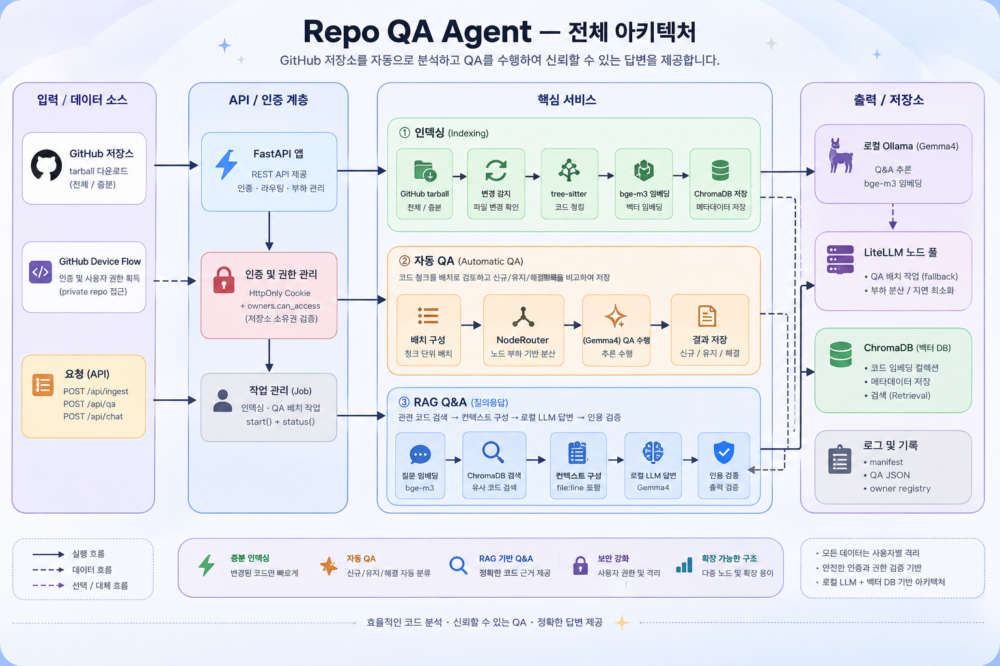
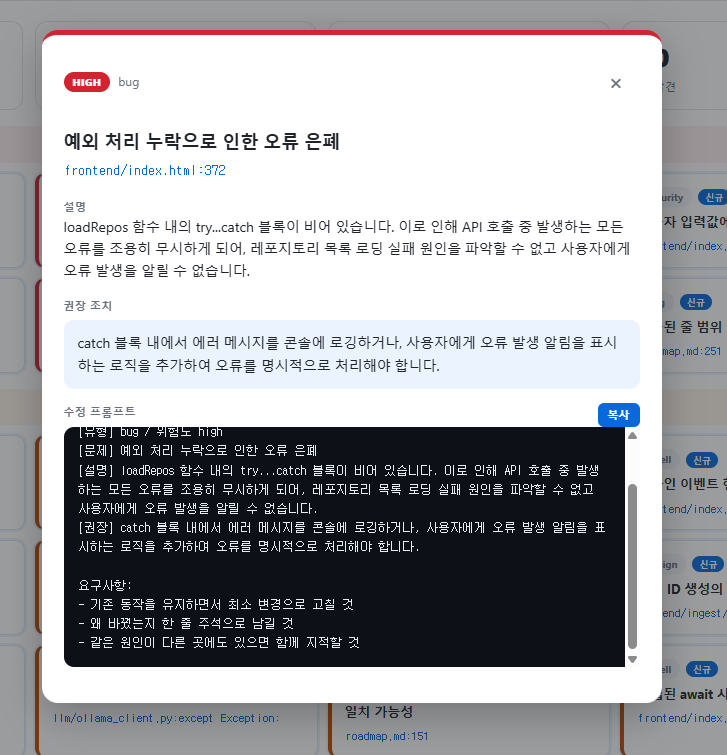

# Repo QA Agent

로컬 LLM으로 **GitHub 저장소를 자동 코드 QA + 자연어 Q&A** 하는 인하우스 도구.
코드가 외부 클라우드로 안 나감 — 인덱싱·분석 전부 로컬 GPU(또는 사내 LiteLLM)에서.

## 무엇을 하나

- **자동 QA** — 레포 넣으면 버그·보안·코드냄새·설계·문서 결함을 심각도별로 리포트. 이전 실행 대비 `신규 / 해결됨` diff 표시.
- **자연어 Q&A** — "로그인 어디서 처리해?" → `file:line` 인용해서 답변. 근거 없으면 "못 찾음"(환각 방지).
- **멀티노드 분산** — 로컬 GB10 + 사내 LiteLLM 노드에 QA 배치를 부하 기준으로 흩뿌려 병렬 처리 후 병합.
- **GitHub 로그인 + 격리** — OAuth Device Flow로 각자 자기 계정 로그인, 자기 권한 레포만 인덱싱·조회.

## 구조



```
GitHub tarball ─→ tree-sitter 청킹 ─→ bge-m3 임베딩 ─→ ChromaDB
                                                          │
   자동 QA ◄── 노드풀 분산(로컬 + LiteLLM) ◄── gemma4 검토 ─┤
   Q&A     ◄── RAG 검색 + file:line 인용 + 환각검증 ◄───────┘
```

| 레이어 | 스택 |
|---|---|
| 백엔드 | FastAPI |
| 임베딩 | bge-m3 (로컬 Ollama) |
| 추론 | gemma4 (로컬 + 사내 LiteLLM 노드) |
| 벡터DB | ChromaDB (증분 인덱싱) |
| 청킹 | tree-sitter (함수/클래스 단위) |
| 프론트 | Vanilla JS (빌드리스) |

## 실행

```bash
# 1) 의존성
python -m venv .venv && .venv/bin/pip install -r requirements.txt

# 2) 환경변수 (.env)
cp .env.example .env      # 값 채우기 (LiteLLM 키, GitHub OAuth Client ID 등)

# 3) Ollama 모델 (로컬)
ollama pull gemma4:31b bge-m3

# 4) 서버
cd backend && ../.venv/bin/uvicorn app:app --host 0.0.0.0 --port <PORT>
```

→ 브라우저에서 해당 포트로 접속

## 사용 흐름

1. **GitHub 로그인** (private 레포용) — 우상단 버튼, Device Flow
2. **레포 URL 입력 → 가져오기·인덱싱**
3. **QA 분석 실행** — 심각도별 발견사항, 카드 클릭 시 상세 + 수정 프롬프트 복사
4. **대화** — 우측 드로어에서 코드 질문

발견사항 클릭 → 상세 + 코딩 에이전트용 수정 프롬프트:



## 설정 (.env)

| 키 | 설명 |
|---|---|
| `RQA_LITELLM_URL` / `RQA_LITELLM_KEY` / `RQA_LITELLM_MODEL` | 원격 LiteLLM 노드 (없으면 로컬 단일) |
| `RQA_GH_CLIENT_ID` | GitHub OAuth App Client ID (Device Flow 활성 필요) |
| `RQA_MODEL` / `RQA_EMBED` | 로컬 모델 오버라이드 |
| `RQA_MAX_QA_CHUNKS` | QA 검토 청크 상한 |

> `.env`는 커밋 금지 (`.gitignore` 포함). 실제 키·주소는 전부 여기에만.

## 보안

- 코드·시크릿 커밋 안 됨 — 소스엔 하드코딩 0, 전부 `.env`.
- 사용자별 레포 격리 — 남의 인덱스는 목록에도 안 뜨고 직접 API 호출도 404.
- private 레포 토큰은 서버 메모리에만, 클라이언트는 불투명 세션 ID만 보관.